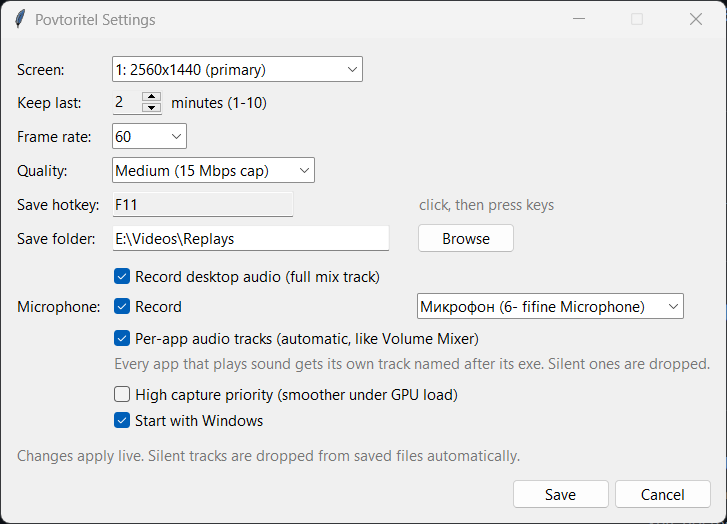

# Povtoritel

ShadowPlay-style instant replay for Windows. Keeps the last 1-10 minutes of a
chosen screen in a RAM ring buffer and dumps it to an MP4 when you press the
hotkey. Runs as a tray icon, starts with Windows.

The whole UI is a tray icon (red dot = buffering, gray = paused) with a menu,
and this settings window:



## Setup

Needs Python 3.12+ and a static ffmpeg (not committed here). One time:

```
powershell -ExecutionPolicy Bypass -File setup.ps1
pythonw povtoritel.pyw
```

`setup.ps1` downloads a static ffmpeg build into `bin\`. First launch writes
`config.json` with defaults, generates the tray icons, and registers autostart.

## How it works

- `ffmpeg` (static build in `bin\`) captures the desktop with `ddagrab`
  (Desktop Duplication, frames stay on the GPU) and encodes with NVENC
  (`h264_nvenc`) on the RTX 3080. If the picked screen ever hangs off the
  AMD iGPU instead, the app switches to that adapter automatically
  (`h264_amf`), still zero-copy.
- ffmpeg is always stopped gracefully (a `q` on its stdin command channel,
  kill only as a 3s-timeout fallback) so NVENC/D3D11 contexts release
  cleanly and a loaded GPU is never poked by a hard TerminateProcess.
- "High capture priority" (off by default) raises the ffmpeg process to GPU
  scheduling class High (`D3DKMTSetProcessSchedulingPriorityClass`) and CPU
  AboveNormal, like OBS does. Measured benefit after the MPO fix was small,
  and preempting a fully loaded GPU is a stability risk on this machine, so
  leave it off unless captures stutter again.
- Audio goes into SEPARATE tracks in the mp4 (for DaVinci Resolve etc),
  Volume-Mixer style and fully automatic: a session watcher polls
  IAudioSessionManager2 like the Windows mixer does, and every app that
  starts playing sound gets its own per-process loopback capture and its
  own AAC track named after its exe. Plus a Desktop track (full mix) and
  an optional Microphone track (device selectable). Everything is fed to
  ffmpeg as raw PCM over named pipes, silence-filled so sync never drifts.
- On save, tracks that made no sound inside the saved window are dropped
  automatically, so the file contains exactly the apps you actually heard.
- Implementation detail: ffmpeg inputs are fixed at spawn, so the app keeps
  a pool of `app_slots` generic tracks (default 6, config.json) and the
  watcher assigns apps to free slots as they start playing (one slot per
  exe for the whole capture run; apps beyond the pool stay in the Desktop
  mix, logged). stdin is reserved as ffmpeg's command channel for graceful
  shutdown.
- The encoded MPEG-TS stream is piped into the Python process (32 MB pipe,
  high-priority reader, CFR timestamps, so the encoder never stalls and
  frame pacing stays even) and kept in a RAM deque trimmed to the
  configured window. Nothing is written to disk until you save.
- On hotkey the buffered bytes are remuxed to MP4 with `-c copy`
  (no re-encode), so saving takes about a second.
- Long recording writes the same encoded stream to a temporary MPEG-TS file
  from Start to Stop, then remuxes it to MP4 without starting a second capture
  or encoder session.

## Usage

- Replay hotkey (default `Ctrl+Alt+R`): save the last X minutes.
- Long recording hotkey (default `Ctrl+Alt+L`): start recording now, then
  press it again to stop and save. The Settings checkbox can instead use a
  two-second hold of the replay hotkey for both Start and Stop. A quick press
  still saves an instant replay.
- Save notifications always appear at the top-right of the screen selected
  for capture, even when another screen has focus. The toast is click-through,
  kept above fullscreen apps, never steals focus, and is excluded from capture.
- Tray icon: red dot = buffering, gray = paused.
  - Left or right click: menu (Save replay now, Start or Stop long recording,
    Pause, Open folder, Settings, Start with Windows, Quit).
  - Double click: Settings.
- Settings window: screen picker, buffer length 1-10 min, 30/60/120/144
  fps, quality (Low/Medium/High bitrate caps), both hotkeys, two-second hold,
  save folder,
  desktop audio on/off, microphone on/off with device picker, automatic
  per-app tracks on/off, capture priority, autostart. Changes apply live;
  capture restarts when capture-affecting settings change.

### Hotkey rules

Click the hotkey field, then press keys. A modifier press (Shift, Ctrl, Alt,
in any combination) waits for a regular key: `Shift+Alt` alone never
registers, `Shift+Alt+X` does. The first regular key ends the capture, so
things like `M+N` are impossible. A bare key (`F9`) is also allowed.
Esc cancels.

Extra held modifiers are tolerated: with the hotkey set to `F11`, pressing
it while holding Shift or Ctrl (sprinting or crouching in a game) still
saves. Hotkeys use a global low-level keyboard hook, so they still receive
key presses when a fullscreen game does not deliver `RegisterHotKey` events.
Keys are never blocked from reaching the game.

## CLI

```
pythonw povtoritel.pyw            # start the tray app (single instance)
py povtoritel.pyw --settings      # settings window
py povtoritel.pyw --save          # trigger a save from a script
py povtoritel.pyw --quit          # stop the running app
py povtoritel.pyw --check         # print diagnostics
```

## Files

- `config.json` - settings
- `povtoritel.log` - app log (rotates at 1 MB)
- `ffmpeg.log` - capture/remux stderr
- `bin\ffmpeg.exe` - static gyan.dev build (8.1.2)

## Smooth capture under 100% GPU load

Desktop Duplication only gets a new frame when the Windows compositor (DWM)
presents one. With a fullscreen game and Multiplane Overlay (MPO) on, the
game renders on its own hardware plane at full rate while the desktop plane
DDA captures updates much slower, so recording fps drops even though the
game is fluid. Fixes, strongest first:

1. Disable MPO (biggest fix). `mpo_disable.reg` sets
   `HKLM\SOFTWARE\Microsoft\Windows\Dwm\OverlayTestMode = 5`. Needs admin
   and a sign-out/reboot. Revert with `mpo_enable.reg`. This is applied on
   this machine.
2. High capture priority (Settings checkbox, default on).
3. Run the game in Borderless / Windowed, not exclusive fullscreen.
   Exclusive fullscreen bypasses DWM and DDA cannot capture it well.

Even so, DDA is capped at the on-screen (DWM) rate. Matching a game's exact
in-engine framerate under load is only possible with a game-capture hook
that injects into the game, which anti-cheat (Hunt uses EasyAntiCheat) can
ban for, so this app does not do it. NVIDIA's own Instant Replay (NVIDIA
app) uses a private NVIDIA capture path and will beat any DDA tool here.

## Notes and limits

- Audio follows the DEFAULT output device. If you switch devices
  (speakers to headphones), the app picks the new one up within about
  10 seconds. If A/V sync ever feels off, set `audio_offset_ms` in
  config.json (positive delays audio) and save settings or run --reload.
- One screen at a time; recording several screens at once would need one
  encoder session per screen (easy to add later).
- The RAM buffer is cleared whenever capture restarts: settings change,
  pause then resume, screen lock or sleep. Pause alone keeps the buffer,
  so Pause then Save still works.
- While the desktop is unavailable (lock screen, display sleep) capture
  fails and retries with backoff, up to once a minute, forever. It resumes
  by itself once the desktop is back; no manual Resume needed.
- RAM use scales with content: static desktop is tiny, busy gameplay tops
  out around bitrate cap x window (Medium, 5 min: about 550 MB worst case).
- Autostart is an HKCU Run registry entry named `Povtoritel`. Remove with
  `reg delete HKCU\Software\Microsoft\Windows\CurrentVersion\Run /v Povtoritel`
  or untick it in Settings.
